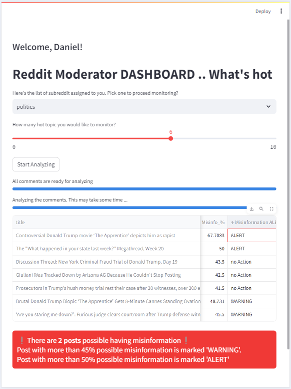

# Streamlit-Reddit-Moderator-Dashboard
A web app (Proof of Concept) for Reddit Moderator to filter out content with possibility of presenting misinformation. The app is hosted on Streamlit IO, which can be accessed through this [link](https://reddit-moderator-dashboard.streamlit.app/)

This app leverages on a misinformation prediction model developed in project [Distinguish Facts from Misinformation on Reddit](https://github.com/cy-chin/Distinguish-Facts-from-Misinformation).
